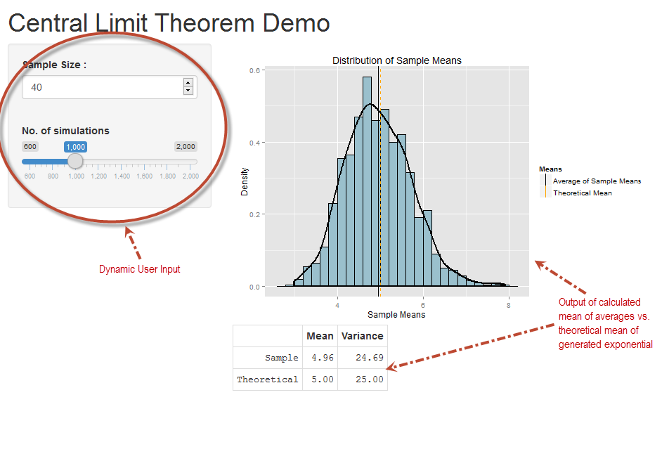
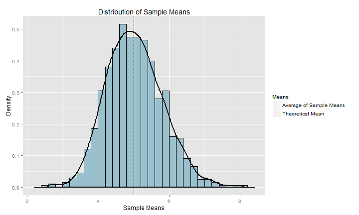

Central Limit Theorem Demo
========================================================
author: Rumy Dukandar
date: December 23 2015
transition: rotate

<small> 
Johns Hopkins University   
Coursera Data Science Specialization
</small>

Central Limit Theorem: What does it mean?
========================================================

<small> 
This document tries to explain the shiny [demo](https://rumyd.shinyapps.io/ShinyProject) for an important concept of Central Limit Theorem in Statistics which states that the sampling distribution of the sampling means approaches a normal distribution as the sample size gets larger - no matter what the shape of the population distribution.

If random samples, each of size n, are taken from (nearly) any population with a mean MU and a standard deviation SIGMA , the sampling distribution of the sample means (averages) will:

1.	Have True Mean (Mean of Sample mean values) = Population Mean
2.	Have Standard Deviation (of the distribution of Sample Mean) equal to the standard error 
</small>

CLT Demo Setup
========================================================

<small>
We will demonstrate CLT using randomly generated exponential distribution in R and compare it with the Central Limit Theorem. The exponential distribution will be generated in R and number of simulations and sample
size for deriving averages, will be input by the user. Lambda (rate paratmeter) for demo purpose is fixed at 0.2.

The goal is to plot the distribution of averages and compare the same to theoretical mean and variance.
</small>

User Interface for CLT Demo 
===

<small>
In the shiny [demo](https://rumyd.shinyapps.io/ShinyProject), user select values for 
sample size (value between 20 to 60) and number of simulationns (value between 600 to  2000)
The interface with user input widgets and the graphical and tabular output looks as per the figure below

</small>

CLT Live Demo Output as a plot
========================================================

<small>
Plot shown below is generated live for 1000 simulations each with sample size of 40, the rate parameter lambda being constant at 0.2. The difference in theoretical mean (1/lambda) and mean of sample averages is negligible and the ditribution of sample averages is fairly normal.
</small>

